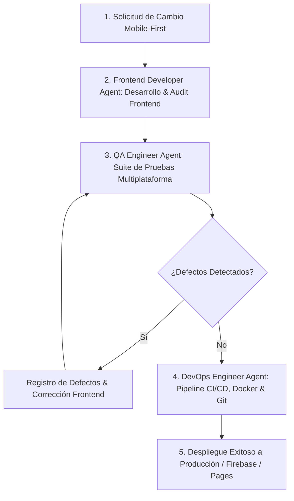

# Guía de Agentes y Flujo de Trabajo (WebRioJaneiro)

Este proyecto cuenta con un equipo de 3 agentes especializados (**Frontend Developer**, **QA Engineer** y **DevOps Engineer**) que colaboran mediante un **Flujo de Trabajo Estándar Integrado (Frontend -> QA -> DevOps -> Deploy)** bajo una **Estrategia Obligatoria Mobile-First**.

---

## 📱 Regla Maestra: Estrategia de Diseño Mobile-First

**Absolutamente todo lo desarrollado debe ser diseñado e implementado bajo el criterio Mobile-First**:
1. **Prioridad Móvil**: La maquetación base en CSS/HTML se estructura para dispositivos móviles (Android / iOS con viewports de 360px a 430px).
2. **Mejora Progresiva**: Las pantallas más grandes (tablets y escritorios Windows/Mac) se adaptan mediante *Media Queries* progresivas (`@media (min-width: ...)`).
3. **Cero Truncamiento & Flexbox Robusto**: Los componentes UI (como la barra flotante, tarjetas y carruseles) deben contar con `min-width: 0`, `overflow-wrap: anywhere` y controles táctiles (*touch targets* mínimo 44px x 44px).

---

## 🔄 Flujo de Trabajo Estándar Integrado (5 Fases)



### Fase 1: Solicitud de Cambio (CR)
- Se define el requerimiento bajo diseño y alcance **Mobile-First**.

### Fase 2: Desarrollo Front End (Frontend Developer Agent)
- Implementación de código en HTML5, CSS3 Mobile-First, JS ES6+ o datos.
- Ejecución de auditoría preliminar: `python scripts/frontend_audit.py`

### Fase 3: Auditoría de Calidad (QA Engineer Agent)
- Ejecución de suite de pruebas rigurosa multiplataforma: `python scripts/qa_audit.py`
- Emisión del reporte de calidad en `tests/qa_report.md`.

### Fase 4: Integración y Despliegue (DevOps Engineer Agent)
- El **DevOps Engineer Agent** ejecuta la verificación de infraestructura:
  ```bash
  python scripts/devops_audit.py
  ```
- Gestiona ramas `dev` y `main`, y ejecuta el pipeline integrado:
  ```bash
  python scripts/workflow_pipeline.py
  ```

### Fase 5: Despliegue a Producción (Firebase Hosting / GitHub Actions)
- El DevOps Agent realiza el commit convencional (`feat:`, `fix:`, `ci:`) y sincroniza los cambios en las ramas `dev` y `main` para detonar el despliegue automático a producción.

---

## 🎨 Rol del Frontend Developer Agent
- **Responsabilidad**: Maquetación HTML5 Mobile-First, estilos Glassmorphism CSS, JavaScript ES6+ e interactividad.
- **Auditoría**: `python scripts/frontend_audit.py`

## 🛡️ Rol del QA Engineer Agent
- **Responsabilidad**: Auditoría de calidad Mobile-First, responsividad Android/iOS/Windows/Mac, accesibilidad y fidelidad del itinerario.
- **Auditoría**: `python scripts/qa_audit.py`

## 🚀 Rol del DevOps Engineer Agent
- **Responsabilidad**: Mantenimiento de infraestructura CI/CD (GitHub Actions), Dockerization, control de versiones Git (`dev` / `main`), automatización del pipeline y despliegues a Firebase Hosting.
- **Auditoría**: `python scripts/devops_audit.py`
