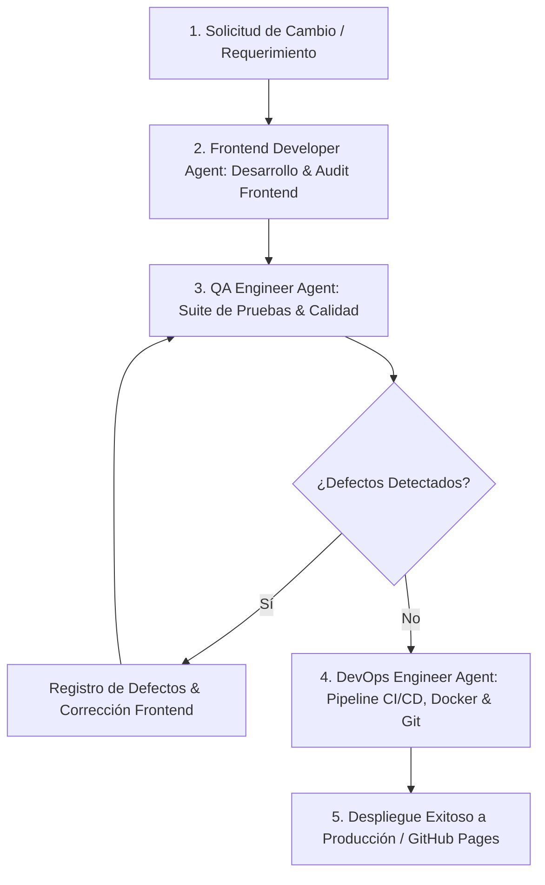

# Guía de Agentes y Flujo de Trabajo (WebRioJaneiro)

Este proyecto cuenta con un equipo de 3 agentes especializados (**Frontend Developer**, **QA Engineer** y **DevOps Engineer**) que colaboran mediante un **Flujo de Trabajo Estándar Integrado (Frontend -> QA -> DevOps -> Deploy)** para cada cambio, actualización o entrega.

---

## 🔄 Flujo de Trabajo Estándar Integrado (5 Fases)



### Fase 1: Solicitud de Cambio (CR)
- Se define el requerimiento, alcance visual y funcional.

### Fase 2: Desarrollo Front End (Frontend Developer Agent)
- Implementación de código en HTML, CSS, JS o datos.
- Ejecución de auditoría preliminar: `python scripts/frontend_audit.py`

### Fase 3: Auditoría de Calidad (QA Engineer Agent)
- Ejecución de suite de pruebas: `python scripts/qa_audit.py`
- Emisión del reporte de calidad en `tests/qa_report.md`.

### Fase 4: Integración y Despliegue (DevOps Engineer Agent)
- El **DevOps Engineer Agent** toma el control para ejecutar la verificación de infraestructura:
  ```bash
  python scripts/devops_audit.py
  ```
- Valida el build del contenedor Docker de producción, gestiona las ramas `dev` y `main`, y ejecuta el pipeline de CI/CD:
  ```bash
  python scripts/workflow_pipeline.py
  ```

### Fase 5: Despliegue a Producción (GitHub Actions / Pages)
- El DevOps Agent realiza el commit convencional (`feat:`, `fix:`, `ci:`) y sincroniza los cambios en las ramas `dev` y `main` para detonar el despliegue en GitHub Pages.

---

## 🎨 Rol del Frontend Developer Agent
- **Responsabilidad**: Maquetación HTML5, estilos Glassmorphism CSS, JavaScript ES6+ e interactividad.
- **Auditoría**: `python scripts/frontend_audit.py`

## 🛡️ Rol del QA Engineer Agent
- **Responsabilidad**: Auditoría de calidad, responsividad, accesibilidad y fidelidad del itinerario.
- **Auditoría**: `python scripts/qa_audit.py`

## 🚀 Rol del DevOps Engineer Agent
- **Responsabilidad**: Mantenimiento de infraestructura CI/CD (GitHub Actions), Dockerization, control de versiones Git (`dev` / `main`), automatización del pipeline y despliegues a producción.
- **Auditoría**: `python scripts/devops_audit.py`
