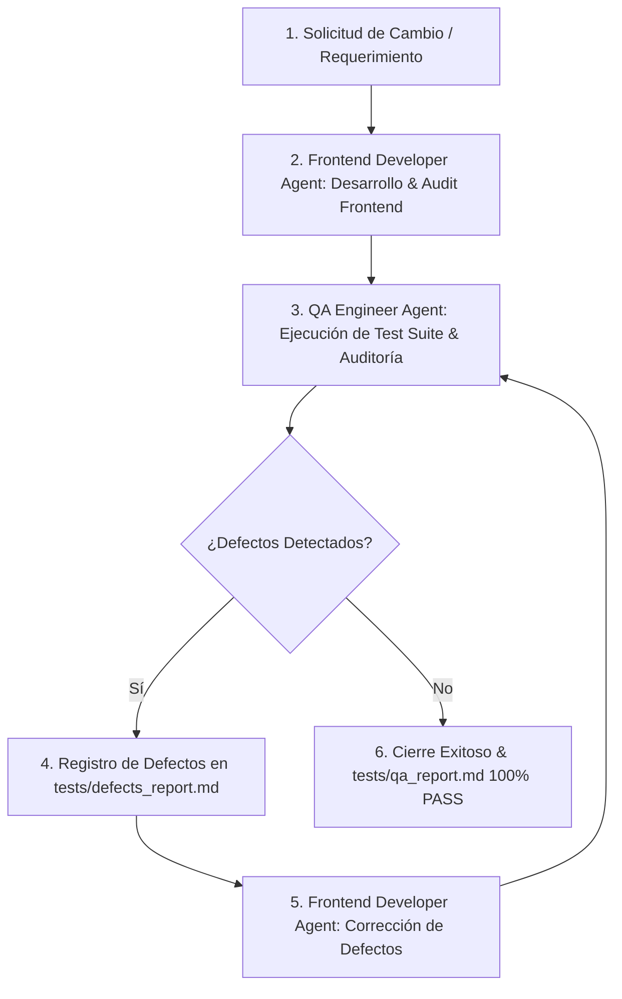

# Guía de Agentes y Flujo de Trabajo (WebRioJaneiro)

Este proyecto cuenta con un equipo de agentes especializados que colaboran mediante un **Flujo de Trabajo Estándar e Iterativo (Frontend -> QA -> Fix Loop)** para cada cambio, actualización o nueva funcionalidad de la aplicación web.

---

## 🔄 Flujo de Trabajo Estándar (Workflow Pipeline)



### Fase 1: Solicitud de Cambio (CR)
- El requerimiento se analiza definiendo el alcance en la interfaz, datos o funcionalidades interactivas.

### Fase 2: Desarrollo Front End (Frontend Developer Agent)
- El **Frontend Developer Agent** implementa los cambios en `index.html`, `css/styles.css`, `js/data.js` o `js/app.js`.
- Aplica las directivas de los skills `frontend-developer`, `ui-design-system`, `interactive-components` y `web-performance-a11y`.
- Ejecuta la auditoría preliminar:
  ```bash
  python scripts/frontend_audit.py
  ```

### Fase 3: Pruebas de Calidad (QA Engineer Agent)
- El **QA Engineer Agent** toma el control para evaluar la entrega.
- Ejecuta la suite automatizada de pruebas:
  ```bash
  python scripts/qa_audit.py
  ```
- Si detecta errores, crea el archivo de reporte de defectos en `tests/defects_report.md` clasificándolos en:
  - **CRITICAL**: Errores que bloquean el servidor o rompen la carga de la página.
  - **MAJOR**: Fallos en componentes interactivos, botones o discrepancias con el PDF de itinerario.
  - **MINOR**: Desalineaciones menores de UI o etiquetas aria faltantes.

### Fase 4: Ciclo de Corrección y Re-Prueba (Fix & Re-Test)
- El **Frontend Developer Agent** lee `tests/defects_report.md` y aplica las correcciones.
- El **QA Engineer Agent** re-ejecuta la suite hasta obtener el 100% PASS y emite el `tests/qa_report.md` oficial de aprobación.

---

## 🎨 Rol del Frontend Developer Agent
- **Responsabilidad**: Maquetación HTML5, estilos Glassmorphism CSS, JavaScript ES6+ e interactividad de la app.
- **Auditoría**: `python scripts/frontend_audit.py`

## 🛡️ Rol del QA Engineer Agent
- **Responsabilidad**: Auditoría de calidad, responsividad, accesibilidad y fidelidad del itinerario.
- **Auditoría**: `python scripts/qa_audit.py`
