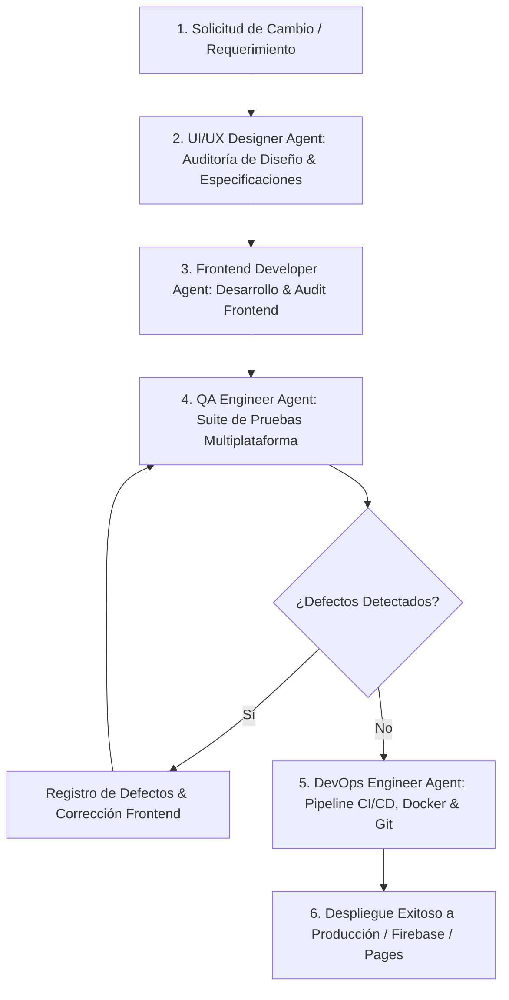

# Guía de Agentes y Flujo de Trabajo (WebRioJaneiro)

Este proyecto cuenta con un equipo de 4 agentes especializados (**UI/UX Designer**, **Frontend Developer**, **QA Engineer** y **DevOps Engineer**) que colaboran mediante un **Flujo de Trabajo Estándar Integrado de 4 Fases (UI/UX -> Frontend -> QA -> DevOps -> Deploy)** bajo una **Estrategia Obligatoria Mobile-First**.

---

## 📱 Regla Maestra: Estrategia de Diseño Mobile-First & Glassmorphism

**Absolutamente todo lo desarrollado debe ser diseñado e implementado bajo el criterio Mobile-First**:
1. **Prioridad Móvil Ergónomica**: La maquetación base en CSS/HTML se estructura primeramente para dispositivos móviles (Android / iOS con viewports de 360px a 430px) priorizando la zona táctil del pulgar (*thumb zone*).
2. **Mejora Progresiva**: Las pantallas más grandes (tablets y escritorios Windows/Mac) se adaptan mediante *Media Queries* progresivas (`@media (min-width: ...)`).
3. **Cero Truncamiento & Flexbox Robusto**: Los componentes UI (como la barra flotante, tarjetas y carruseles) deben contar con `min-width: 0`, `overflow-wrap: anywhere` y controles táctiles (*touch targets* mínimo 44px x 44px).

---

## 🔄 Flujo de Trabajo Estándar Integrado (5 Fases)



### Fase 1: Solicitud de Cambio (CR)
- Se define el requerimiento bajo alcance **Mobile-First**.

### Fase 2: Diseño & Experiencia de Usuario (UI/UX Designer Agent)
- Audita el sistema de diseño visual, jerarquía tipográfica, paleta Glassmorphism y ergonomía táctil.
- Ejecución de auditoría de diseño: `python scripts/ux_audit.py`
- Emite las especificaciones de diseño y propuestas de mejora para el desarrollador.

### Fase 3: Desarrollo Front End (Frontend Developer Agent)
- Implementa el código en HTML5 semántico, CSS3 Mobile-First, JS ES6+ modular o datos.
- Ejecución de auditoría de desarrollo: `python scripts/frontend_audit.py`

### Fase 4: Auditoría de Calidad (QA Engineer Agent)
- Ejecución de suite de pruebas rigurosa multiplataforma: `python scripts/qa_audit.py`
- Emisión del reporte de calidad en `tests/qa_report.md`.

### Fase 5: Integración y Despliegue (DevOps Engineer Agent)
- El **DevOps Engineer Agent** ejecuta la verificación de infraestructura:
  ```bash
  python scripts/devops_audit.py
  ```
- Gestiona ramas `dev` y `main`, y ejecuta el pipeline de integración continua:
  ```bash
  python scripts/workflow_pipeline.py
  ```

### Fase 6: Despliegue a Producción (Firebase Hosting / GitHub Actions)
- Sincroniza las ramas `dev` y `main` para detonar el despliegue automático a producción.

---

## 🎨 Equipo de Agentes Especializados

### 💎 1. Rol del UI/UX Designer Agent
- **Responsabilidad**: Definición del sistema de diseño Glassmorphism, ergonomía táctil, propuestas continuas de mejoras de usabilidad, tipografía y micro-interacciones.
- **Auditoría**: `python scripts/ux_audit.py`

### 💻 2. Rol del Frontend Developer Agent
- **Responsabilidad**: Maquetación HTML5 Mobile-First, estilos CSS, JavaScript ES6+ e interactividad.
- **Auditoría**: `python scripts/frontend_audit.py`

### 🛡️ 3. Rol del QA Engineer Agent
- **Responsabilidad**: Auditoría de calidad Mobile-First, responsividad Android/iOS/Windows/Mac, accesibilidad y fidelidad del itinerario.
- **Auditoría**: `python scripts/qa_audit.py`

### 🚀 4. Rol del DevOps Engineer Agent
- **Responsabilidad**: Mantenimiento de infraestructura CI/CD (GitHub Actions), Dockerization, control de versiones Git (`dev` / `main`), automatización del pipeline y despliegues continuos.
- **Auditoría**: `python scripts/devops_audit.py`
