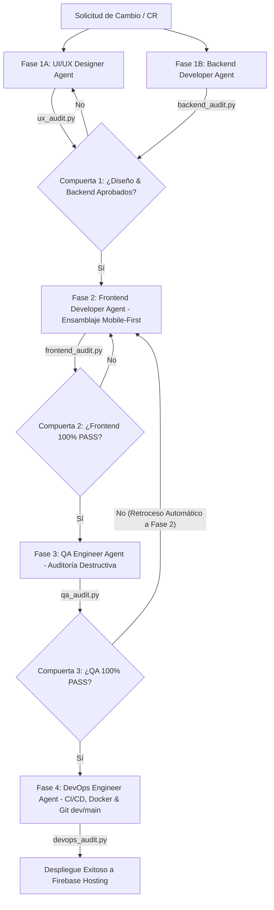

# Guía de Agentes y Protocolo de Orquestación Estricto (WebRioJaneiro)

Este documento establece el **Manifiesto de Orquestación Estricto** para el escuadrón de **5 agentes especializados** (**UI/UX Designer**, **Backend Developer**, **Frontend Developer**, **QA Engineer** y **DevOps Engineer**).

---

## ⚖️ Principios Arquitectónicos Maestros

1. **Fuente Única de Verdad**:
   - Ante cualquier discrepancia técnica, las reglas globales definidas en el archivo `gemini.md` tienen **prioridad absoluta** sobre los criterios individuales de los agentes.

2. **Límites de Dominio (Separation of Concerns)**:
   - Ningún agente tiene permitido sobreescribir la capa arquitectónica de otro.
   - Si el Frontend Developer Agent detecta un problema en un endpoint, contrato o esquema de datos, debe delegar la corrección al Backend Developer Agent, en lugar de parcharlo en la vista.

3. **Estrategia Obligatoria Mobile-First**:
   - Todo componente UI se maqueta primeramente para dispositivos móviles (Android / iOS de 360px a 430px) priorizando la zona táctil del pulgar (*thumb zone*).
   - Adaptación progresiva mediante *Media Queries* (`@media (min-width: 851px)`).
   - Flexbox robusto con `min-width: 0`, `overflow-wrap: anywhere` y objetivos táctiles mínimos de 44px x 44px.

---

## 🔄 Ciclo de Vida de Desarrollo (Pipeline Secuencial de 4 Fases con Compuertas)

### 🎨 Fase 1: Contratos y Diseño (Paralelo: UI/UX & Backend)
- **UI/UX Designer Agent**: Define la ergonomía táctil, sistema de diseño Glassmorphism, paleta de colores y jerarquía tipográfica.
- **Backend Developer Agent**: Estructura los contratos de API, integraciones externas (Open-Meteo, Firebase, Leaflet), esquemas en `data.js` y seguridad OWASP.
- **Compuerta 1**: Ambos scripts (`scripts/ux_audit.py` y `scripts/backend_audit.py`) deben ser ejecutados y retornar **100% PASS** antes de liberar su trabajo a la Fase 2.

### 💻 Fase 2: Ensamblaje (Frontend Developer Agent)
- **Frontend Developer Agent**: Toma los recursos y contratos aprobados de la Fase 1. Se encarga exclusivamente de la maquetación Mobile-First HTML5/CSS3 y la interactividad JS en la vista, sin alterar la lógica server-side.
- **Compuerta 2**: Debe ejecutar y asegurar que `scripts/frontend_audit.py` retorne cero errores (100% PASS).

### 🛡️ Fase 3: Verificación (QA Engineer Agent)
- **QA Engineer Agent**: Recibe el build. Ejecuta pruebas destructivas y analíticas de responsividad multiplataforma (Android, iOS, Windows, Mac), accesibilidad táctil WCAG y precisión del itinerario.
- **Compuerta 3**: Valida con `scripts/qa_audit.py`. Si la suite detecta algún defecto, **el ticket retrocede a la Fase 2 automáticamente** registrando las fallas en `tests/defects_report.md`.

### 🚀 Fase 4: Despliegue y Contenerización (DevOps Engineer Agent)
- Interviene **únicamente si la Fase 3 es 100% exitosa**.
- **DevOps Engineer Agent**: Infraestructura inmutable, transiciones seguras entre ramas (`dev` a `main`), contenerización mediante `Dockerfile` optimizado (Nginx Alpine) y ejecución del pipeline CI/CD en GitHub Actions.
- **Compuerta 4**: Finaliza validando con `scripts/devops_audit.py`.

---

## 👥 Matriz de Roles y Responsabilidades

| Agente | Fase / Modalidad | Responsabilidad Principal | Script de Auditoría / Compuerta |
|---|---|---|---|
| **Software Architect Agent** | Consultivo (Ad-Hoc) | Revisión holística de arquitectura, patrones SOLID, deuda técnica y seguridad OWASP | `python scripts/architect_audit.py` |
| **UI/UX Designer Agent** | Fase 1 (Paralelo) | Ergonomía táctil, Tokens Glassmorphism, Tipografía | `python scripts/ux_audit.py` |
| **Backend Developer Agent** | Fase 1 (Paralelo) | Contratos de API, Open-Meteo, Firebase, OWASP | `python scripts/backend_audit.py` |
| **Frontend Developer Agent** | Fase 2 | Maquetación HTML5 Mobile-First, CSS3, JS View | `python scripts/frontend_audit.py` |
| **QA Engineer Agent** | Fase 3 | Pruebas destructivas, Responsividad, Loopback | `python scripts/qa_audit.py` |
| **DevOps Engineer Agent** | Fase 4 | Docker Alpine, CI/CD Actions, Git dev/main | `python scripts/devops_audit.py` |
