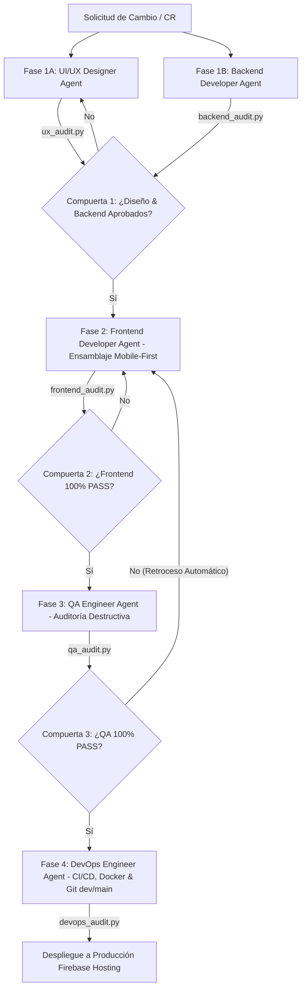

# Agile Workflow Orchestrator Skill — Manifiesto de Orquestación Estricta

Este Skill establece el **Protocolo de Orquestación Estricto** para el escuadrón de 5 agentes especializados (**UI/UX Designer**, **Backend Developer**, **Frontend Developer**, **QA Engineer** y **DevOps Engineer**), garantizando el cumplimiento de la arquitectura Mobile-First, la separación de responsabilidades y las directrices de `gemini.md`.

---

## 🏛️ Principios Rectores

1. **Fuente Única de Verdad**:
   - Las reglas globales definidas en `gemini.md` tienen prioridad absoluta sobre cualquier criterio individual de los agentes.

2. **Límites de Dominio (Separation of Concerns)**:
   - Ningún agente puede sobreescribir la capa arquitectónica de otro.
   - Si el Frontend Developer detecta un problema en un endpoint o esquema de datos, debe delegar la corrección al Backend Developer Agent, en lugar de parcharlo en la vista.

---

## 🔄 Ciclo de Vida de Desarrollo (Pipeline Secuencial de 4 Fases con Compuertas)



### 1. Fase 1 — Contratos y Diseño (Paralelo: UI/UX & Backend)
- **UI/UX Designer Agent**: Define la ergonomía táctil, sistema de diseño Glassmorphism y jerarquía tipográfica.
- **Backend Developer Agent**: Estructura los contratos de API, integraciones (Open-Meteo, Firebase, Leaflet) y seguridad OWASP.
- **Compuerta 1**: Ambos agentes deben ejecutar y aprobar `scripts/ux_audit.py` y `scripts/backend_audit.py` antes de liberar los insumos a la Fase 2.

### 2. Fase 2 — Ensamblaje (Frontend Developer Agent)
- **Frontend Developer Agent**: Toma los recursos y contratos aprobados de la Fase 1. Maquetación HTML5 semántica Mobile-First e interactividad en JS sin alterar la lógica server-side.
- **Compuerta 2**: Debe ejecutar y asegurar que `scripts/frontend_audit.py` retorne cero errores (100% PASS).

### 3. Fase 3 — Verificación (QA Engineer Agent)
- **QA Engineer Agent**: Ejecuta pruebas destructivas y analíticas de responsividad multiplataforma, accesibilidad táctil y precisión del itinerario.
- **Compuerta 3**: Audita mediante `scripts/qa_audit.py`. Si se detecta algún fallo, **el ticket retrocede a la Fase 2 automáticamente** registrando las discrepancias en `tests/defects_report.md`.

### 4. Fase 4 — Despliegue y Contenerización (DevOps Engineer Agent)
- Interviene **únicamente si la Fase 3 fue 100% exitosa**.
- **DevOps Engineer Agent**: Infraestructura inmutable, transiciones seguras entre ramas (`dev` a `main`), contenerización mediante `Dockerfile` optimizado y pipeline CI/CD en GitHub Actions.
- **Compuerta 4**: Finaliza validando con `scripts/devops_audit.py`.

---

## 📋 Ejecución del Orquestador General

Para ejecutar el flujo completo y validar las 4 compuertas de forma automatizada:

```bash
python scripts/workflow_pipeline.py
```
