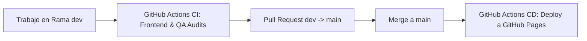

# Guía de Contribución y Estrategia de Ramas (Git Flow & CI/CD)

Este documento establece las mejores prácticas de la industria para el desarrollo, integración y despliegue del proyecto **WebRioJaneiro**.

---

## 🌿 Estrategia de Ramas (Branching Model)

El proyecto utiliza una estrategia adaptada de **Git Flow / Trunk-Based**:

1. **`main` (Producción)**:
   - Contiene el código estable y listo para producción.
   - Todo `push` a `main` activa el despliegue automático a **GitHub Pages**.
   - Solo se fusiona código proveniente de `dev` a través de Pull Requests aprobados.

2. **`dev` (Integración y Desarrollo)**:
   - Rama principal de integración para el trabajo activo.
   - Cada commit o PR a `dev` activa la suite automatizada de CI (Auditorías de Frontend, QA y build de Docker).

3. **`feature/*` o `fix/*` (Ramas de Trabajo)**:
   - Creadas a partir de `dev` para implementar cambios específicos (ej. `feature/itinerario-mapa`, `fix/navbar-hover`).
   - Se integran a `dev` mediante Pull Requests.

---

## 📝 Convención de Commits (Conventional Commits)

Utilizar el formato estándar:
- `feat:` Nueva funcionalidad o componente UI (ej: `feat: agregar vista de Posto 2 en Copacabana`).
- `fix:` Corrección de un defecto en la aplicación (ej: `fix: corregir salto de navbar en hover`).
- `ci:` Cambios en workflows de GitHub Actions o Docker (ej: `ci: agregar pipeline de despliegue a GitHub Pages`).
- `docs:` Cambios en la documentación o itinerario (ej: `docs: actualizar fechas de vuelo a agosto 2026`).
- `chore:` Tareas rutinarias sin cambio de código o assets.

---

## ⚙️ Flujo Integrado de CI/CD (GitHub Actions)



### Ejecución Local de Pruebas Antes del Push:
```bash
python scripts/frontend_audit.py
python scripts/qa_audit.py
python scripts/workflow_pipeline.py
```
